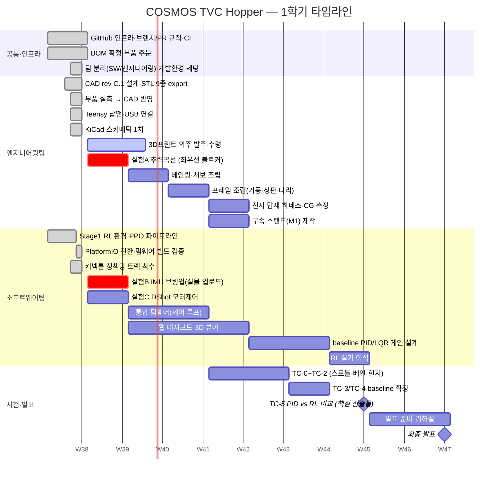

# COSMOS 프로젝트 타임라인 — 한 장으로 보기

**이 문서 하나만 보면 "어디까지 왔고 뭐가 남았는지"가 보인다.** 주차별 팀 계획은
[`semester-roadmap.md`](semester-roadmap.md), 개인별 태스크는 [`member-weekly-tasks.md`](member-weekly-tasks.md) —
여기는 그 둘을 **시각적으로 요약만** 한다(같은 내용을 다시 적지 않는다).

**기준일: 2026-09-20(일).** 주차는 월~일. Week 1 = 9/14~9/20(오늘로 끝), Week 2 = 9/21 시작.

---

## 1. 전체 간트차트

> 빨간 항목(`crit`)이 **지금 당장 병목**이다 — 아래 §4 참고.

---

## 2. 지금까지 한 것 (Week 1, ~9/20)

| 팀 | 한 것 | 증거 |
|---|---|---|
| 공통 | GitHub Organization·레포 개설, 브랜치·PR 규칙 확정, CI 구축(sim + 펌웨어 빌드 자동검사) | PR #1·#3·#11 |
| 공통 | BOM 확정 및 부품 주문 완료 | `docs/design/BOM-revC-teensy.md` |
| 공통 | **팀 분리(SW 3명 / 엔지니어링 4명)**, 전원 개발환경 세팅 완료 | 9/18 주간보고서 |
| 엔지니어링 | CAD rev C.1(장비선반·서보보스·스파커플러) + **STL 9종 실제 export** + 조립 렌더 | PR #2/#7, `cad/renders/` |
| 엔지니어링 | 주요 부품 실측 → `hopper_params.scad` 반영 | `cad/measurements.md` |
| 엔지니어링 | **Teensy 4.0 핀헤더 납땜 + 빵판·USB 연결 성공** | 9/19 실물 확인 |
| 엔지니어링 | KiCad 아비오닉스 스키매틱 1차(부품 20·넷 30) | `kicad/cosmos-avionics/` |
| 소프트웨어 | Stage 1 RL 환경 + PPO 파이프라인 검증, `Kf` 플레이스홀더 보정 | PR #10, `sim/sim_stage1/` |
| 소프트웨어 | **Arduino IDE → PlatformIO 전환**, 펌웨어 2종 빌드 검증, 컴파일 버그 1건 수정 | PR #11·#13 |
| 소프트웨어 | 커넥톰 제약 정책망 확장 트랙 착수 | PR #9, `sim/connectome/` |

---

## 3. 남은 것 — 팀별 병렬 진행

### 엔지니어링팀 (김민찬·박지훈·이민우·김시우)

| 시기 | 할 일 | 완료 판정 |
|---|---|---|
| Week 2 | **3D프린트 외주 발주**(STL은 이미 준비됨) | 발주서 전송 + `cad/print-orders/`에 스냅샷 커밋 |
| Week 2 | **실험 A — EDF 추력곡선** | `data/`에 추력·전류 CSV |
| Week 3 | 베인링 + 서보 4개 + 베인·스파 조립 | ±15° 하드스톱 확인 |
| Week 4 | 프레임 조립(기둥·상판·EDF클램프·다리) | 직각·비틀림 확인 |
| Week 5 | 전자 탑재(만능기판·하네스 H1~H10), 질량·CG 측정 | 횡 CG ≤3mm |
| Week 5 | 구속 스탠드(M1) 제작 | 삼각대+만능조인트 조립 완료 |

### 소프트웨어팀 (김준원·김민지·권재후)

| 시기 | 할 일 | 완료 판정 |
|---|---|---|
| Week 2 | **실험 B — IMU 실물 업로드**(컴파일은 이미 통과) | 시리얼에 Roll/Pitch/Yaw, 부호 확인 |
| Week 2 | **실험 C — DShot 모터제어** | 스로틀 명령 → EDF 회전 확인 |
| Week 2 | 실험 A 결과로 `params.yaml` `Kf` 실측값 교체 | 커밋 메시지에 출처 명시 |
| Week 3~4 | 통합 펌웨어(제어 루프) — 믹서 단일 EDF화, RC 워치독 | `pio run` 통과 + 구속 시험 가능 |
| Week 3~6 | 웹 대시보드·3D 뷰어 (W-A→W-E) | PID/RL 비교 차트 동작 |
| Week 6~7 | baseline PID/LQR 게인 설계·튜닝 | TC-3 발산 없음 |
| Week 8 | RL 실기 이식 | TC-5 데이터 확보 |

### 공통 — 시험 카드 (실험·운영)

`00-hopper-master-design.md` §11 순서 그대로: **TC-0**(스로틀) → **TC-1**(베인 방향) → **TC-2**(힌지모멘트)
→ **TC-2.5**(자이로 커플링) → **TC-3**(자세안정화) → **TC-4**(외란) → **TC-5**(RL 비교, 발표 핵심)
→ (여유 시) TC-6·TC-7(홉).

---

## 4. 지금 당장의 병목 3개

1. **실험 A(추력곡선)를 아직 못 했다** — `sim/params.yaml`의 `Kf`가 실측이 아니라서, 지금 RL을 아무리
   학습시켜도 **결과를 읽으면 안 된다**(베인 제어권한이 실제보다 37배 작게 잡혀 있음, `README.md` 경고
   참고). 소프트웨어팀 전체가 이 하나에 막혀 있다 — **최우선.**
2. **실험 B(IMU) 실물 업로드 미완** — 컴파일까지만 검증됨. Teensy는 이미 연결돼 있으니
   `cd firmware/cosmos/imu_test && pio run -t upload` 한 줄이면 된다.
3. **3D프린트 외주 미발주** — STL 9종은 이미 나와 있다. 발주 리드타임이 길어서 늦으면 Week 3 조립이 밀린다.

## 5. 안 지켜져도 되는 계획이다

부장이 정한 원칙: **매주 100% 달성이 목표가 아니다.** 원래 문제는 "이번 주에 각자 뭘 할지가
정해져 있지 않은 것"이었다. 못 끝낸 건 다음 주로 넘기고, 이 문서의 날짜를 그때 고치면 된다 —
실제와 안 맞는 계획표를 그대로 두지 않는 것이 유일한 규칙이다.

---

## 6. 상세는 어디에

| 알고 싶은 것 | 문서 |
|---|---|
| 이번 주 팀별로 뭘 하나 (세션 A/B 단위) | [`semester-roadmap.md`](semester-roadmap.md) |
| 이번 주 **내 이름**으로 뭐가 배정됐나 | [`member-weekly-tasks.md`](member-weekly-tasks.md) |
| Week 1–2 원본 실행계획·부품 리스트 | [`week-01-kickoff.md`](week-01-kickoff.md) |
| 시험 카드(TC-0~TC-7) 합격 기준 | [`../design/00-hopper-master-design.md`](../design/00-hopper-master-design.md) §11 |
| 배선·핀맵 | [`../design/01-avionics-integration-final.md`](../design/01-avionics-integration-final.md) |
